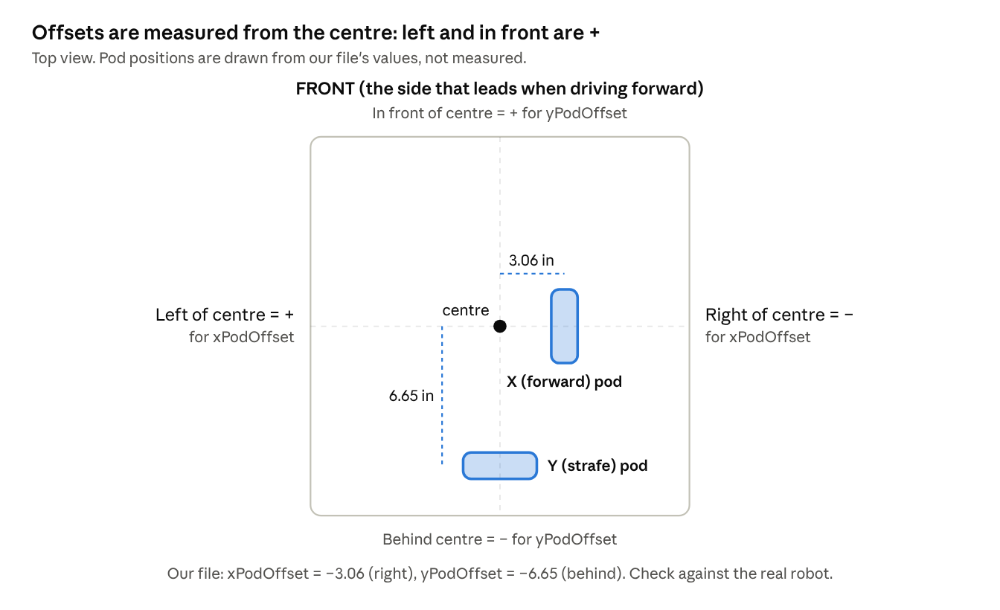
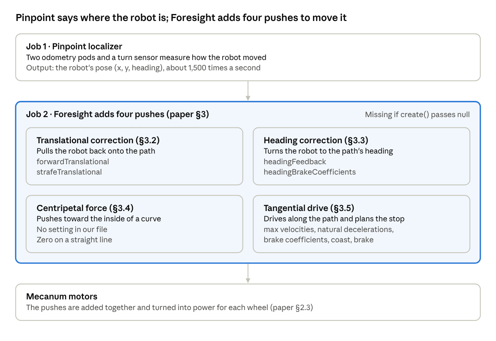

# Pedro Pathing Constants Explained (Pinpoint)

Oct 5, 2026 · @Girish

**Version 2.3** (7 Oct 2026). New in this version: a staged Tuning.java (only), built into the [Tuning Checklist](Tuning_Checklist.md). See *Version history* near the end.

Doing the tuning? Follow the step-by-step checklist: [Tuning Checklist](Tuning_Checklist.md)

## Start here: pod directions and offsets

Four settings decide whether the robot knows where it is: `xPodDirection`, `yPodDirection`, `xPodOffset` and `yPodOffset`. **Get these right before touching any other number in this guide.** If they are wrong, no amount of tuning will fix the path following.

### Why this matters most

- **Following depends on localization.** Foresight steers using the pose that Pinpoint reports (paper, §3.1–§3.5). A wrong pose means the robot corrects toward the wrong place.
- **Pedro says so directly.** "Ensure that your localization is fully accurate before running automatic tuners" ([Pedro docs: Troubleshooting](https://pedropathing.com/docs/pathing/faq)).
- **Every Foresight number was measured through the Pinpoint.** The Foresight tuner reads all of its speeds, slow-downs and braking distances from the localizer ([ForesightTuner.java](https://github.com/Pedro-Pathing/Quickstart/blob/master/TeamCode/src/main/java/org/firstinspires/ftc/teamcode/pedro/procedures/ForesightTuner.java)). Bad localization during tuning can carry into those values.
- **Wrong directions or offsets are known causes.** Reversed encoder directions and inaccurate or switched offsets are both on Pedro's list of causes of inaccurate localization (Pedro docs: Troubleshooting).
- **We have an open question here.** Our `yPodOffset` (−6.65 in) says the strafe pod is *behind* the centre, but our pods are mounted at the front. See *Does the placement of the odometry pods matter?* below.

### First: which way is "forward" and "left"?

Every sign below depends on this, so settle it first.

1. Run **Tests → Driving** and push the stick forward. The side of the robot that leads is the robot's **forward** ([Pedro docs: Mecanum](https://pedropathing.com/docs/pathing/tuning/drivetrain/mecanum)).
2. Stand behind the robot facing that way. Your left hand points to the robot's **left**. For the robot, forward is +x and left is +y ([Pedro docs: Types of Velocities](https://pedropathing.com/docs/pathing/reference/velocity)).
3. Write "FRONT" on that side with tape so everyone uses the same forward.

### Encoder directions

| Setting | goBILDA's rule | How the tuner sets it | Our value |
| --- | --- | --- | --- |
| `xPodDirection` | The X (forward) pod count must go **up** when the robot moves **forward** ([goBILDA guide, p. 2](https://www.gobilda.com/content/user_manuals/3110-0002-0001%20User%20Guide.pdf)) | You push the robot forward. If x ends positive → `FORWARD`; negative → `REVERSED` ([PinpointTuner.java](https://github.com/Pedro-Pathing/Quickstart/blob/master/TeamCode/src/main/java/org/firstinspires/ftc/teamcode/pedro/procedures/PinpointTuner.java)) | `FORWARD` |
| `yPodDirection` | The Y (strafe) pod count must go **up** when the robot moves **left** (goBILDA guide, p. 2) | You push the robot left. If y ends positive → `FORWARD`; negative → `REVERSED` (PinpointTuner.java) | `FORWARD` |

**Where it can go wrong** (from reading the tuner code):

- The tuner only checks whether the final number is positive or negative, not how far you pushed. Make a clear, straight push of a foot or more.
- "Forward" is whichever way you pushed. If that is not the side that leads when driving, the Pinpoint and the motors disagree. Wrong directions can make a robot "move infinitely" during tuning (Pedro docs: Troubleshooting).
- The forward pod must be in the Pinpoint's **X** port and the strafe pod in the **Y** port ([Pedro docs: Pinpoint](https://pedropathing.com/docs/pathing/tuning/localization/pinpoint)).

**Check:** run **Tests → Localization**. Push toward the robot's forward: x must go up. Push to its left: y must go up ([Pedro docs: Localization](https://pedropathing.com/docs/pathing/tuning/localization)).

### Offsets

Offsets tell the Pinpoint where each pod sits compared with the robot's centre. Pedro measures them from the robot's centre of rotation (Pedro docs: Pinpoint). Our file uses inches.

| Setting | What it measures (goBILDA guide, p. 2) | + means | − means | Our value | So our pod is… |
| --- | --- | --- | --- | --- | --- |
| `xPodOffset` | How far **sideways** the X (forward) pod is from the centre | Left of centre | Right of centre | −3.06 in | About 3.1 in **right** of centre |
| `yPodOffset` | How far **forward** the Y (strafe) pod is from the centre | In front of centre | Behind centre | −6.65 in | About 6.7 in **behind** centre |

If our pods are really at the front, the Y pod in this picture is on the wrong side, which is the open question above.

Only one direction counts for each pod. For the X pod, measure sideways only; how far forward it sits does not matter. For the Y pod, measure forward or back only (goBILDA guide, p. 2). Measure to the line the pod's wheel rolls along, as in Pedro's diagram (Pedro docs: Pinpoint, Manual Offset Tuning).

| Example | Value to enter |
| --- | --- |
| X pod 3 in left of centre | `xPodOffset = 3.0` |
| X pod 3 in right of centre | `xPodOffset = -3.0` |
| Y pod 6 in in front of centre | `yPodOffset = 6.0` |
| Y pod 6 in behind centre | `yPodOffset = -6.0` |
| Pod exactly on the centre line | `0.0` |

### How the tuner finds offsets, and how it can go wrong

The tuner sets both offsets to 0. You turn the robot 180° counterclockwise in place, then stop the OpMode (Pedro docs: Pinpoint). The robot did not really move, but with zero offsets the Pinpoint thinks it did. The tuner then sets xPodOffset = −y ÷ 2 and yPodOffset = −x ÷ 2 from that fake movement (PinpointTuner.java).

That only works for a clean spin. These risks follow from the formula; the error sizes are our own arithmetic:

- **The robot slides while turning.** Real movement of the centre is mixed into the result. Every 1 in of slide adds about 0.5 in of offset error.
- **It spins around the wrong point.** The tuner treats whatever point you spun around as the centre.
- **The directions were wrong.** The direction steps come first, so their errors carry into the offsets.
- Being a few degrees short of 180° matters much less (about 1–2% error).

### Tuner or ruler?

Both are allowed: the Pedro docs say offsets "can also be found manually" (Pedro docs: Pinpoint).

|  | Built-in tuner | Ruler measurement |
| --- | --- | --- |
| How | Calculates offsets from a 180° spin | Measure from the centre to each pod |
| Main risks | Sliding, wrong spin point, wrong directions | Guessing the centre, wrong sign |
| Signs | Worked out for you | You apply the + / − rules above |
| Best use | First estimate | Checking the tuner |

### Procedure

1. Settle forward and left (above) and mark FRONT on the robot.
2. Check the encoder directions with Tests → Localization.
3. Measure both offsets with a ruler and write them with the right signs.
4. Re-run the Pinpoint tuner 2–3 times. Tape a cross on the floor under the robot's centre and keep the centre over it while turning slowly through 180°.
5. Compare. If tuner and ruler agree within a fraction of an inch, keep the tuner value. If the sign differs or they are more than about an inch apart, use the ruler value.
6. **Spin test (the final judge):** spin the robot several times in place and put it back on its mark. x and y should return close to 0 (see Test A, step 3).
7. If the directions changed, re-run the Foresight tuner, because all its measurements came through the Pinpoint (ForesightTuner.java).

## How to use this guide

This guide explains every number in our `Constants.java` file: what it measures, where it came from, and what it does to the robot. It is written for students who are new to Pedro Pathing.

**Our setup:** a mecanum drivetrain, a goBILDA Pinpoint odometry computer with two goBILDA 4-bar pods, and Pedro Pathing 3 with its path-following algorithm called **Foresight**.

**The one rule of this guide:** every explanation points to a source. Sources are the Pedro Pathing paper (the PDF we attached), the official Pedro Pathing docs, the Pedro Pathing tuner code on GitHub, and the goBILDA Pinpoint user guide. When the sources do not explain something, this guide says so instead of guessing.

**How to read it:**

1. Read *Start here* first and check our robot. Then read *The big picture*. It explains how the robot knows where it is and how it follows a path.
2. Use *Every parameter, explained* as a lookup table when you want to know what one number does.
3. Use *Fixing the Line Test* when the robot is misbehaving. It goes from the biggest, simplest problems to the smallest ones. *Our Line Test investigation* records our own symptoms, checks and results.

Worked examples that plug our numbers into a formula are marked **Our numbers**. The formula always comes from a source; only the arithmetic is ours.

## The big picture

To drive an autonomous path, the robot has two jobs. **Job 1:** know where it is (the Pinpoint does this). **Job 2:** push itself along the path (the Foresight algorithm does this). Job 2 can only be as good as Job 1. The Pedro docs say to make sure localization is fully accurate before running the automatic tuners ([Pedro docs: Troubleshooting](https://pedropathing.com/docs/pathing/faq)).

Read it top to bottom: Pinpoint finds the pose, Foresight turns it into four pushes, and the motors carry them out.

### Job 1: How Pinpoint knows where the robot is

- The robot has two **odometry pods**. These are small wheels with no motor that roll on the floor and count how far they turn.
- The **X pod** (forward pod) measures forward and backward motion. The **Y pod** (strafe pod) measures sideways motion ([goBILDA Pinpoint User Guide, p. 2](https://www.gobilda.com/content/user_manuals/3110-0002-0001%20User%20Guide.pdf)).
- The Pinpoint also has a factory-calibrated sensor for turning (yaw), so it knows the robot's heading (same guide, p. 2).
- It combines all of this about 1,500 times per second (same guide, p. 1).
- The answer is called the robot's **pose**: x, y and heading. For the robot itself, forward is +x and left is +y ([Pedro docs: Types of Velocities](https://pedropathing.com/docs/pathing/reference/velocity)). Turning counterclockwise is a positive heading change ([Pedro docs: Coordinates](https://pedropathing.com/docs/pathing/reference/coordinates)).
- How good is it? goBILDA says a robot driven around and brought back should read within about 10 mm (\~0.5 inch) of where it started (goBILDA guide, p. 7).

### Job 2: How Foresight follows a path

The paper describes Pedro Pathing's method as a **guiding vector field**. Picture an arrow drawn at every spot near the path. Each arrow tells the robot which way to speed up so it moves onto the path and along it (paper, Abstract and §3). The arrow is built by adding four separate pushes:

| Push (paper section) | What it does, in plain words | Settings in our file that belong to it |
| --- | --- | --- |
| Translational correction (§3.2) | Pulls the robot sideways back onto the path, along the shortest line to it | `forwardTranslational`, `strafeTranslational` |
| Heading correction (§3.3) | Turns the robot to face the direction the path asks for | `headingFeedback`, `headingBrakeCoefficients` |
| Centripetal force (§3.4) | Extra push toward the inside of a curve so the robot does not slide outward | None in our file. On a straight line the formula gives zero, because the path does not bend |
| Tangential drive (§3.5) | The main push along the path. It also plans when to slow down so the robot stops at the end | `maxAchievable...Velocity`, `natural...Deceleration`, `linearBrakeCoefficients`, `quadraticBrakeCoefficients`, `coast`, `brake` |

Two more ideas from the paper help with everything below:

- **The closest point and "t" (§3.1).** The robot keeps finding the point on the path closest to itself. Positions along the path are numbered with t, from 0 at the start to 1 at the end.
- **Planning the stop (§3.5).** Basic physics says the robot can still stop in time if its speed is below √(2 × deceleration × distance left). The paper notes that friction and other forces change this. So Pedro instead measures how far the robot slides while braking at different speeds, then works backward to find the right speed (paper, footnote 2). The brake coefficients in our file are exactly that measurement.

The paper proves the robot will settle onto the path "with sufficiently well-chosen scalar gains" (paper, Theorem 4.6). The gains are the tuned numbers in our file. That is why tuning matters.

## Every parameter, explained

Our file has four parts: the `create` method, the drivetrain settings, the Pinpoint settings and the Foresight settings ([Pedro docs: Constants](https://pedropathing.com/docs/pathing/tuning/constants)). Blocks wrapped in `/* ... */` are comments. Java ignores them, so only the active blocks below matter.

### Part A: The `create` method (putting the robot together)

| Line in our file | What it means | What it does to the robot |
| --- | --- | --- |
| `new PinpointLocalizer(h, localizerConfig)` | Job 1: use the Pinpoint with our Pinpoint settings | Gives the follower the robot's pose |
| `new Mecanum(h, drivetrainConfig)` | Use our four mecanum motors with our motor settings | Lets the follower send power to the wheels |
| `null //new Foresight(foresightConfig)` | Job 2 is switched off. The Pedro docs show this spot must be `new Foresight(foresightConfig)` ([Pedro docs: Constants](https://pedropathing.com/docs/pathing/tuning/constants)) | Every tuned Foresight number in our file is never handed to a follower made by `create`. The docs only use `null` here for the localization test ([Pedro docs: Localization](https://pedropathing.com/docs/pathing/tuning/localization)) |

### Part B: Drivetrain (`MecanumConfig`)

| Setting | Our value | What it means |
| --- | --- | --- |
| `frontLeftName`, `backLeftName`, `frontRightName`, `backRightName` | Names from `HardwareNames` | Must match the motor names in the Driver Hub configuration ([Pedro docs: Mecanum](https://pedropathing.com/docs/pathing/tuning/drivetrain/mecanum)) |
| `frontLeftDirection`, `backLeftDirection` | `REVERSE` | Left motors are flipped so "forward power" spins every wheel forward. The tuner checks each motor and you confirm it spun the right way (same page) |
| `frontRightDirection`, `backRightDirection` | `FORWARD` | Same check for the right side |
| `manualBrakeMode` | Not in our file | Optional. The docs say to add it for TeleOp if you want brake mode (same page) |

### Part C: Pinpoint (`PinpointConfig`)

| Setting | Our value | What it means | What a wrong value does |
| --- | --- | --- | --- |
| `name` | `"pinpoint"` | The Pinpoint's name in the Driver Hub configuration ([Pedro docs: Pinpoint](https://pedropathing.com/docs/pathing/tuning/localization/pinpoint)) | The robot code cannot find the Pinpoint |
| `podType` | `goBILDA_4_BAR_POD` | Tells the Pinpoint how many encoder ticks equal one millimetre. The 4-bar pod has a 2000-count encoder and a 32 mm wheel, which is 19.894 ticks per mm ([goBILDA guide, p. 2](https://www.gobilda.com/content/user_manuals/3110-0002-0001%20User%20Guide.pdf)) | Every distance comes out too big or too small |
| `xPodOffset` | `-3.06` in | How far **sideways** the X (forward) pod is from the robot's centre. Left is positive, right is negative (goBILDA guide, p. 2). So our forward pod is about 3.1 in to the **right** of centre | When the robot only turns, the pose can look like it moved. The tuner finds offsets by turning the robot 180° in place and measuring that fake movement ([PinpointTuner.java](https://github.com/Pedro-Pathing/Quickstart/blob/master/TeamCode/src/main/java/org/firstinspires/ftc/teamcode/pedro/procedures/PinpointTuner.java)) |
| `yPodOffset` | `-6.65` in | How far **forward** the Y (strafe) pod is from the centre. Forward is positive, backward is negative (goBILDA guide, p. 2). So our strafe pod is about 6.7 in **behind** centre | Same as above |
| `xPodDirection` | `FORWARD` | The X pod count must go up when the robot moves forward (goBILDA guide, p. 2) | Pushing forward makes x go down |
| `yPodDirection` | `FORWARD` | The Y pod count must go up when the robot moves left (goBILDA guide, p. 2) | Pushing left makes y go down |
| `globalDistanceUnit`, `offsetUnits` | `INCH` | Positions and offsets are in inches. The tuner writes both lines (PinpointTuner.java) | Numbers are read in the wrong unit |

Pedro's offset diagram shows the same idea: the forward pod's sideways distance and the strafe pod's forward distance, both measured from the centre of the robot ([Pedro docs: Pinpoint, Manual Offset Tuning](https://pedropathing.com/docs/pathing/tuning/localization/pinpoint)).

### Part D: Foresight — top speed and stopping (the tangential drive push)

These numbers let the robot plan when to slow down so it stops on the end point (paper, §3.5).

| Setting | Our value | What it is and how the tuner measured it | What it does to the robot |
| --- | --- | --- | --- |
| `maxAchievableForwardVelocity` | 57.6 in/s | Top forward speed. The tuner drives at full power and averages the last 10 speed readings ([ForesightTuner.java](https://github.com/Pedro-Pathing/Quickstart/blob/master/TeamCode/src/main/java/org/firstinspires/ftc/teamcode/pedro/procedures/ForesightTuner.java)) | The paper models a robot with a different top speed in each direction (paper, §2.3) |
| `maxAchievableStrafeVelocity` | 45.2 in/s | Top sideways speed, measured the same way while driving left | Same, for sideways motion |
| `naturalForwardDeceleration` | 34.6 in/s² | How fast the robot slows down by itself. The tuner drives to 30 in/s, cuts the power and averages the slow-down (ForesightTuner.java) | Used to work out how far the robot will coast with no power ([Pedro docs: Deceleration](https://pedropathing.com/docs/pathing/reference/deceleration)) |
| `naturalStrafeDeceleration` | 70.7 in/s² | Same, while strafing | Same, for sideways motion |
| `linearBrakeCoefficients` | forward 0.0518, strafe 0.0361 | Braking distance = linear × speed + quadratic × speed². The tuner drives, brakes at several powers, and fits this curve (ForesightTuner.java). In `Matrix.diag(a, b)`, `a` is forward and `b` is strafe (the tuner writes them in that order) | This is the "measured braking distance" from paper footnote 2. The robot uses it to decide when to start braking |
| `quadraticBrakeCoefficients` | forward 0.00244, strafe 0.00271 | The speed² part of the same curve | Same |
| `coast` | kV = 0.01776 | A feedforward: output = target speed × kV ([Pedro docs: Controllers](https://pedropathing.com/docs/pathing/reference/controllers)). The tuner drives at 40% power for 1.2 s, finds the steady speed per unit of power, and sets kV = 1 ÷ that (ForesightTuner.java) | Turns "I want this speed" into "send this much power" |
| `brake` | kV = 0.01510 | The tuner sets it to 0.85 × the coast kV (ForesightTuner.java) | Same idea, used for braking. The docs do not explain exactly when Foresight switches between coast and brake |

**Our numbers — braking distance.** Using the formula above: at full forward speed (57.6 in/s) the robot needs about 0.0518 × 57.6 + 0.00244 × 57.6² ≈ **11.1 in** to stop. At 30 in/s it needs about **3.8 in**. At full strafe speed (45.2 in/s) it needs about **7.2 in**.

**Our numbers — sanity check.** 1 ÷ 0.01776 ≈ 56.3 in/s at full power. That is close to our measured top speed of 57.6 in/s, so the two tests agree.

### Part E: Foresight — staying on the line (the translational push)

| Setting | Our value | What it is | What it does to the robot |
| --- | --- | --- | --- |
| `forwardTranslational` | small kP 0.1337, large kP 0.3619, switch at 2.5 in | A **piecewise** controller: the small controller is used when the error is under 2.5 in, the large one when it is over ([Pedro docs: Controllers](https://pedropathing.com/docs/pathing/reference/controllers)). Each is **proportional**: output = error × kP (same page) | Corrects position error in the robot's forward direction. The large controller corrects big errors quickly; the small one avoids overshoot near the path (same page) |
| `strafeTranslational` | small kP 0.1367, large kP 0.3699, switch at 2.5 in | Same, for the sideways direction | Pulls the robot sideways back onto the line |

In the code, "primary" is the large controller and "secondary" is the small one. This matches the paper's translational push with gain kₚ (paper, §3.2). The paper also includes a damping gain k\_d; our file has no setting with that name.

**Our numbers — sanity check.** The tuner computes both kPs from one test, using factors 10.2 and 6.2, so large ÷ small should be (10.2 ÷ 6.2)² ≈ 2.71 (ForesightTuner.java). Ours: 0.3619 ÷ 0.1337 ≈ 2.71 and 0.3699 ÷ 0.1367 ≈ 2.71. So these values came straight from the tuner, unchanged.

**If it misbehaves:** overshooting or jittery means kP is too high; slow or weak correction means kP is too low ([Pedro docs: Troubleshooting](https://pedropathing.com/docs/pathing/faq)).

### Part F: Foresight — facing the right way (the heading push)

| Setting | Our value | What it is | What it does to the robot |
| --- | --- | --- | --- |
| `headingFeedback` | kP 4.776 | Proportional controller on heading error. The tuner spins the robot in place at 40% power and calculates kP from how it speeds up (ForesightTuner.java). The docs advise against a piecewise controller here ([Pedro docs: Controllers](https://pedropathing.com/docs/pathing/reference/controllers)) | Turns the robot back to the target heading. Matches the paper's heading gain (paper, §3.3) |
| `headingBrakeCoefficients` | linear 0.0439, quadratic 0.00813 | Turning braking distance = linear × turn speed + quadratic × turn speed² (ForesightTuner.java). The tuner spins back and forth and brakes | Predicts how far the robot keeps turning after it starts braking. The tuner also uses it to hold heading during the braking tests. The docs do not explain more |

**Our numbers.** Turning at 3 rad/s, the robot keeps turning about 0.0439 × 3 + 0.00813 × 3² ≈ 0.205 rad (about 12°) while braking.

### Part G: Settings not in our file (the defaults are used)

These do not appear in our active `ForesightConfig`, so the default values from the docs apply.

| Setting | Default | What it means |
| --- | --- | --- |
| `parametricTConstraint` | 0.025 | The path is "parametrically complete" at t ≥ 0.975 ([Pedro docs: End Constraints](https://pedropathing.com/docs/pathing/reference/endconstraints)). The Line Test turns around at this point ([Tests.java](https://github.com/Pedro-Pathing/Quickstart/blob/master/TeamCode/src/main/java/org/firstinspires/ftc/teamcode/pedro/procedures/Tests.java)) |
| `velocityConstraint` | 0.1 in/s | Robot must be slower than this to count as stopped (End Constraints) |
| `translationalConstraint` | 0.1 in | Robot must be this close to the end point (End Constraints) |
| `headingConstraint` | 0.007 rad (\~0.4°) | Heading must be this close to the target (End Constraints) |
| `timeoutConstraint` | 100 ms | How long it may keep correcting at the end before giving up (End Constraints) |
| `brakeAggression` | 1.0 | Above 1 allows overshoot, below 1 aims to undershoot ([Pedro docs: Path Constraints](https://pedropathing.com/docs/pathing/reference/pathconstraints)) |
| `maxBrakingPower` | 0.2 | Cap on power pushing against the direction of motion (Path Constraints) |
| `maxAccelerationConstraint`, `maxVelocityConstraint`, `maxDecelerationConstraint` | None | No extra limits; the drivetrain's own abilities apply (Path Constraints) |
| `headingDriveRatio` | 0.5 | Higher gives heading correction more priority over driving forward ([Pedro docs: Foresight Options](https://pedropathing.com/docs/pathing/reference/foresightoptions)) |
| `brakeAtEnd` | true | Brake before the final end point instead of coasting (Foresight Options) |
| `translationalDeviationTolerance` | 2.5 in | Beyond this error, the follower fixes position before carrying on (Foresight Options) |
| `headingDeviationTolerance` | 11.25° | Beyond this error, the follower fixes heading before carrying on (Foresight Options) |
| `cosineScale` | false | If on, slows forward speed when errors get large (Foresight Options) |

## Fixing the Line Test

Start at step 1 and only move on when a step passes. Big rocks first: a wrong setup or wrong localization makes every tuned number look wrong.

**What a working Line Test looks like.** The robot drives forward 48 in in a straight line, then back to the start, again and again, always facing the same way ([Pedro docs: Test](https://pedropathing.com/docs/pathing/tuning/test)). It turns around when it reaches t ≥ 0.975 on the path ([Tests.java](https://github.com/Pedro-Pathing/Quickstart/blob/master/TeamCode/src/main/java/org/firstinspires/ftc/teamcode/pedro/procedures/Tests.java)). Note: in the Quickstart code dated 30 Sep 2026, the Line Test always uses 48 in, even if you type another distance (a line in Tests.java sets `distance = 48`).

### Step 1: Is Foresight actually plugged in?

1. **The `create` method.** Our file passes `null` where the docs show `new Foresight(foresightConfig)` ([Pedro docs: Constants](https://pedropathing.com/docs/pathing/tuning/constants)). Any OpMode that builds its follower with `Constants.create(...)` is not using our tuned values.
2. **The `tests()` method in `Tuning.java`.** The Line Test does not use `create`. It builds its own follower from the three things passed to `tests()` (Tests.java). For the Line Test, the third one must be `() -> new Foresight(Constants.foresightConfig)` (Pedro docs: Test). During localization tuning the docs told us to set it to `null` ([Pedro docs: Localization](https://pedropathing.com/docs/pathing/tuning/localization)), so check it was changed back. If it is still `null`, the test stops with the message "Algorithm is required for Hold Test." (Tests.java uses that same message for the Line Test).

**Checked on 5 Oct 2026 — Step 1 passes for the Line Test.** Our `Tuning.java` passes `() -> new Foresight(Constants.foresightConfig)` to `tests()`, exactly as the docs show, and the old `null` line is commented out. So the Line Test *is* using our tuned Foresight values. The `null` in `create` still has to be fixed before we run our own autonomous OpModes, but it is not why the Line Test misbehaves. Go on to Step 2.

### Step 2: Is Job 1 (localization) correct?

1. Run **Tests → Localization**. Push the robot forward: x must go up. Push it left: y must go up. Check the heading is right ([Pedro docs: Localization](https://pedropathing.com/docs/pathing/tuning/localization); [Pedro docs: Troubleshooting](https://pedropathing.com/docs/pathing/faq)).
2. Check the Pinpoint hardware ([Pedro docs: Pinpoint](https://pedropathing.com/docs/pathing/tuning/localization/pinpoint)):
   - Plugged into an I2C port **other than port 0** (the Control Hub's own IMU uses port 0).
   - Mounted sticker side up.
   - Forward pod in the **X** port, strafe pod in the **Y** port.
3. Check the offsets with a ruler. Our file says the forward pod is about 3.1 in right of centre and the strafe pod is about 6.7 in behind centre (see Part C). If the real robot is very different, re-run the Pinpoint tuner or set them by hand using the docs' diagram (Pedro docs: Pinpoint, Manual Offset Tuning).
4. Check accuracy. goBILDA says a robot driven around and returned to its start should read within about 0.5 in of the start ([goBILDA guide, p. 7](https://www.gobilda.com/content/user_manuals/3110-0002-0001%20User%20Guide.pdf)).

### Step 3: Do the motors behave?

Run **Tests → Driving** and drive with the gamepad ([Pedro docs: Mecanum](https://pedropathing.com/docs/pathing/tuning/drivetrain/mecanum)). Reversed motors or wrong motor names can make the robot "move infinitely" during a tuning program ([Pedro docs: Troubleshooting](https://pedropathing.com/docs/pathing/faq)).

### Step 4: Are the tuned numbers trustworthy?

The docs say: use a well-charged battery, re-run the automatic tuners several times, and average the results (Pedro docs: Troubleshooting). The sanity checks in Part D and Part E show our current numbers are self-consistent.

### Step 5: Match the symptom to the setting

Only hand-adjust after steps 1–4 pass. Change one setting at a time.

| What you see in the Line Test | Settings to look at | Source |
| --- | --- | --- |
| Robot drifts sideways off the line | `strafeTranslational` kP: raise if correction is too weak or slow | [Troubleshooting](https://pedropathing.com/docs/pathing/faq) |
| Robot overshoots or jitters while correcting | Lower the kP of the controller involved (translational or heading) | [Troubleshooting](https://pedropathing.com/docs/pathing/faq) |
| Robot does not keep facing the same way | `headingFeedback` kP | [Troubleshooting](https://pedropathing.com/docs/pathing/faq) |
| Robot slides past the 48 in end point | Braking numbers in Part D (re-run the braking tuners first). `brakeAggression` below 1 biases toward undershooting | [Path Constraints](https://pedropathing.com/docs/pathing/reference/pathconstraints) |
| Robot takes too long to finish at the end | Check the final position, heading and speed errors before changing end constraints | [End Constraints](https://pedropathing.com/docs/pathing/reference/endconstraints) |
| Position slowly drifts over many laps | Check whether the localizer's position estimate drifts over time | [Troubleshooting](https://pedropathing.com/docs/pathing/faq) |

**A note on the docs.** The Path Constraints page first says values of `brakeAggression` below 1 bias toward undershooting. It then says "If your robot is undershooting, lower this value," which seems to say the opposite. Ask on the Pedro Discord before relying on that second sentence.

### Step 6: When asking for help

Post in the Pedro Discord **#tuning-help** channel with a video, our constants, and telemetry (Pedro docs: Troubleshooting). The follower's debug strings, such as `follower.debug().algorithm().toString()`, are made for this ([Pedro docs: Debugging](https://pedropathing.com/docs/pathing/guide/debugging)).

## Our Line Test investigation

Our two symptoms point to localization (Job 1) first, so we check that before changing any tuned number. This section records what we saw, why we suspect localization, and the checks to run.

### What we saw

- The robot does not stop at 48 in.
- After a few laps it starts strafing, sometimes to the left and sometimes to the right.

### Is "not stopping at 48" really a problem?

Partly no. The Line Test is not designed to stop and settle at 48 in. It switches to the return path as soon as the robot is 97.5% of the way along the line, because `parametricTConstraint` defaults to 0.025 ([Tests.java](https://github.com/Pedro-Pathing/Quickstart/blob/master/TeamCode/src/main/java/org/firstinspires/ftc/teamcode/pedro/procedures/Tests.java); [Pedro docs: End Constraints](https://pedropathing.com/docs/pathing/reference/endconstraints)). So some carry-past is expected. The real question is **how far** past 48 in it goes, and whether the screen agrees with the floor.

### Why we suspect localization first

The strafing starts "after a point", not on the first lap. If the tuned values were wrong, we would expect trouble from the first lap. Errors that grow over several laps fit a position reading that drifts. This is our reasoning, not a statement from the docs. It matches the Pedro troubleshooting advice for drift in the Line Test: first check whether the localizer's position estimate drifts over time ([Pedro docs: Troubleshooting](https://pedropathing.com/docs/pathing/faq)). The checks below confirm or rule it out.

### Setting up the robot for a test

The Pinpoint reports the position of the robot's centre. Our pod offsets are measured from that point ([Pedro docs: Pinpoint](https://pedropathing.com/docs/pathing/tuning/localization/pinpoint); [goBILDA guide, p. 2](https://www.gobilda.com/content/user_manuals/3110-0002-0001%20User%20Guide.pdf)). The Line Test sets the position to (0, 0) when Start is pressed, so "48" means the centre has moved 48 in (Tests.java).

1. Put a small tape mark on top of the robot at its centre.
2. Line that mark up with the 0 tape line, directly over a straight centre-line tape.
3. Point the robot exactly along the tape line. The test drives in whatever direction the robot faces at Start.
4. Do not touch the robot after pressing Start, because that is when (0, 0) is set.

If the centre is hard to see, line up the front bumper with 0 and judge the front bumper against 48 instead. The robot does not turn on this path, so the bumper moves the same distance as the centre. Never mix the two (for example, bumper at the start and centre at the end).

### Test A: Push the robot by hand (Tests → Localization)

1. Push the robot along the tape from 0 to 48 in. x should read about 48 and y about 0.
2. Push it back to the start. goBILDA says it should read within about 0.5 in of where it started ([goBILDA guide, p. 7](https://www.gobilda.com/content/user_manuals/3110-0002-0001%20User%20Guide.pdf)).
3. Spin it in place a few times and put it back on its mark. x and y should come back close to 0. If they do not, the pod offsets are likely wrong: the Pinpoint tuner finds offsets from exactly this kind of fake movement during a turn ([PinpointTuner.java](https://github.com/Pedro-Pathing/Quickstart/blob/master/TeamCode/src/main/java/org/firstinspires/ftc/teamcode/pedro/procedures/PinpointTuner.java)).

### Test B: During the Line Test, compare the screen with the floor

| What you see | What it means | Where to look |
| --- | --- | --- |
| Robot is clearly off the tape line, but y reads about 0 | The robot does not know it moved (localization drift) | Pod offsets; Pinpoint sticker side up; I2C port not 0; forward pod in X port, strafe pod in Y port ([Pedro docs: Pinpoint](https://pedropathing.com/docs/pathing/tuning/localization/pinpoint)) |
| y matches the real offset, and the robot swings left and right across the line | Over-correcting | Lower `strafeTranslational` kP ([Pedro docs: Troubleshooting](https://pedropathing.com/docs/pathing/faq)) |
| y matches, and the robot slowly drifts one way without coming back | Correcting too weakly | Raise `strafeTranslational` kP (same page) |
| Robot goes well past 48 in, but x says about 48 | Distances are measured wrong | Localization: `podType`, pods |
| x itself reads well past 48 | Braking is too weak | Re-run Forward Deceleration and Forward Braking with a full battery, several times, and average (Troubleshooting). After that, `maxBrakingPower` (default 0.2) caps braking power ([Pedro docs: Path Constraints](https://pedropathing.com/docs/pathing/reference/pathconstraints)) |

### Does the placement of the odometry pods matter?

Our two pods sit in one line at the front of the robot. **Where they sit matters less than whether the offsets match where they are.**

- goBILDA only asks for one pod tracking forward (X) and one tracking sideways (Y). It gives no distance rules ([goBILDA guide, p. 5](https://www.gobilda.com/content/user_manuals/3110-0002-0001%20User%20Guide.pdf)).
- Heading comes from the Pinpoint's built-in IMU, not from the pods (same guide, p. 1).
- We found nothing in the goBILDA or Pedro docs saying front-mounted pods are a problem.

But our file may not match the robot:

| Setting | Value in our file | What it means (goBILDA guide, p. 2) | Matches "both pods at the front"? |
| --- | --- | --- | --- |
| `yPodOffset` | −6.65 in | Strafe pod is 6.65 in **behind** the centre (forward is +) | **No.** A strafe pod at the front should give a positive number |
| `xPodOffset` | −3.06 in | Forward pod is 3.06 in to the **right** of centre (left is +) | Cannot tell; this only describes the sideways distance |

Wrong or switched offsets are on Pedro's list of causes of inaccurate localization ([Pedro docs: Troubleshooting](https://pedropathing.com/docs/pathing/faq)). Two possible explanations:

1. **The robot's "forward" is the side we call the back.** Forward is the side that leads when the robot drives with positive forward power. If that is our "back", the negative `yPodOffset` would be correct.
2. **The tuner result is off.** It works out offsets from a 180° turn in place, so a sloppy turn or wheel slip gives wrong numbers (Pedro docs: Pinpoint). Our file also holds two older, commented-out Pinpoint configs with different offsets.

**Checks (about 5 minutes):**

1. Run Tests → Driving, push the stick forward and note which side of the robot leads ([Pedro docs: Mecanum](https://pedropathing.com/docs/pathing/tuning/drivetrain/mecanum)).
2. With a ruler, measure from the robot's centre: how far sideways the forward pod is, and how far forward or back the strafe pod is. Use the signs from the table above.
3. Do the spin check in Test A, step 3.

### Filming the test for analysis

A video can be checked frame by frame. That shows how far past 48 in the robot goes, when the sideways drift starts, and whether the robot turns. It is weak at very fast wiggles and exact speeds.

1. Keep the camera still (propped up, not handheld). Show the whole 48 in plus about a foot, from above or from the side.
2. Tape a start line, a 48 in line, a straight centre line along the path, and marks every 6 in.
3. Put a strip of tape on top of the robot pointing forward, so turning is easy to see.
4. Record enough laps to catch when the strafing starts.
5. Get the Driver Hub telemetry (x, y, heading) in the same shot, or film it at the same time.
6. Keep clips to about a minute; split long recordings.

### Results log (fill in)

| Check | What we expect | What we measured |
| --- | --- | --- |
| Side that leads when driving forward | Same side we call the front |  |
| Forward pod sideways distance from centre | About 3.06 in right (per our file) |  |
| Strafe pod forward/back distance from centre | About 6.65 in behind (per our file) |  |
| Test A step 1: x, y after pushing 48 in | x ≈ 48, y ≈ 0 |  |
| Test A step 2: x, y after pushing back | Within about 0.5 in of 0 |  |
| Test A step 3: x, y after spinning | Close to 0 |  |
| Line Test: farthest point past 48 in (floor) | Some carry-past |  |
| Line Test: x at that moment (screen) | Should match the floor |  |
| Line Test: lap when strafing starts | None |  |

## Glossary

| Word | Meaning in this guide |
| --- | --- |
| Odometry pod | A small unpowered wheel with an encoder that measures how far the robot rolled |
| Encoder | A sensor that counts small steps (ticks) as a wheel turns |
| Localization | Working out where the robot is on the field |
| Pose | The robot's position (x, y) plus its heading |
| Heading | The direction the robot is facing |
| Strafe | Driving sideways, which a mecanum robot can do |
| Offset | How far a pod is from the robot's centre |
| Error | The gap between where the robot is and where it should be |
| Controller | A rule that turns an error into motor power ([Pedro docs: Controllers](https://pedropathing.com/docs/pathing/reference/controllers)) |
| kP (proportional gain) | Multiplier in a proportional controller: output = error × kP |
| Feedforward, kV | Power sent based on the target, not the error: output = target × kV |
| Piecewise controller | Uses one controller for small errors and another for large errors |
| Deceleration | How quickly speed drops, in inches per second per second (in/s²) |
| Coefficient | A fixed number that multiplies something in a formula |
| Parametric t | A number from 0 (start of path) to 1 (end of path) that marks a spot on the path |
| Guiding vector field | An arrow at every spot near the path showing how the robot should speed up to reach and follow it (paper, §3) |
| Gain | Another word for a tuned multiplier such as kP |

## Version history

| Version | Date | What changed |
| --- | --- | --- |
| 2.3 | 7 Oct 2026 | Only `Tuning.java` is staged now (version 2). `Constants.java` stays our normal file; the checklist says which block to paste over at each stage |
| 2.2 | 7 Oct 2026 | Added staged `Constants.java` and `Tuning.java` (version 1); the *Tuning Checklist* said which block to switch on at each stage. Replaced by 2.3 |
| 2.1 | 7 Oct 2026 | Added the *Tuning Checklist* tab: stages 0–5 with a gate after each, and a sign-off log |
| 2 | 5 Oct 2026 | Added *Start here: pod directions and offsets* at the top (why it matters most, encoder directions, offset signs with a top-view picture, tuner vs ruler, procedure) |
| 1.1 | 5 Oct 2026 | Added *Our Line Test investigation*; confirmed `Tuning.java` passes Foresight to the Line Test |
| 1 | 5 Oct 2026 | First version: big picture, every parameter, fixing the Line Test, glossary, sources |

## Sources

All web pages were opened on 5 Oct 2026. The Pedro docs pages match the Pedro-Pathing/Docs GitHub repository as of 2 Oct 2026.

1. H. Sripada and B. Henderson, *Second-Order Multidimensional Guiding Vector Field for Parametric Path-Following Under Holonomic Constraints* (the attached PDF; contact info@pedropathing.com). Sections used: §2.3, §3.1–§3.5, footnote 2, Theorem 4.6.
2. [Pedro docs: Tuning](https://pedropathing.com/docs/pathing/tuning)
3. [Pedro docs: Mecanum](https://pedropathing.com/docs/pathing/tuning/drivetrain/mecanum)
4. [Pedro docs: Localization](https://pedropathing.com/docs/pathing/tuning/localization)
5. [Pedro docs: Pinpoint](https://pedropathing.com/docs/pathing/tuning/localization/pinpoint)
6. [Pedro docs: Foresight](https://pedropathing.com/docs/pathing/tuning/foresight)
7. [Pedro docs: Constants](https://pedropathing.com/docs/pathing/tuning/constants)
8. [Pedro docs: Test](https://pedropathing.com/docs/pathing/tuning/test)
9. [Pedro docs: Controllers](https://pedropathing.com/docs/pathing/reference/controllers)
10. [Pedro docs: Deceleration](https://pedropathing.com/docs/pathing/reference/deceleration)
11. [Pedro docs: End Constraints](https://pedropathing.com/docs/pathing/reference/endconstraints)
12. [Pedro docs: Path Constraints](https://pedropathing.com/docs/pathing/reference/pathconstraints)
13. [Pedro docs: Foresight Options](https://pedropathing.com/docs/pathing/reference/foresightoptions)
14. [Pedro docs: Types of Velocities](https://pedropathing.com/docs/pathing/reference/velocity)
15. [Pedro docs: Coordinates](https://pedropathing.com/docs/pathing/reference/coordinates)
16. [Pedro docs: Troubleshooting](https://pedropathing.com/docs/pathing/faq)
17. [Pedro docs: Debugging](https://pedropathing.com/docs/pathing/guide/debugging)
18. [ForesightTuner.java](https://github.com/Pedro-Pathing/Quickstart/blob/master/TeamCode/src/main/java/org/firstinspires/ftc/teamcode/pedro/procedures/ForesightTuner.java), Pedro Quickstart, commit 2df9646 (30 Sep 2026)
19. [PinpointTuner.java](https://github.com/Pedro-Pathing/Quickstart/blob/master/TeamCode/src/main/java/org/firstinspires/ftc/teamcode/pedro/procedures/PinpointTuner.java), same commit
20. [Tests.java](https://github.com/Pedro-Pathing/Quickstart/blob/master/TeamCode/src/main/java/org/firstinspires/ftc/teamcode/pedro/procedures/Tests.java), same commit
21. [goBILDA Pinpoint Odometry Computer User Guide (3110-0002-0001)](https://www.gobilda.com/content/user_manuals/3110-0002-0001%20User%20Guide.pdf)
